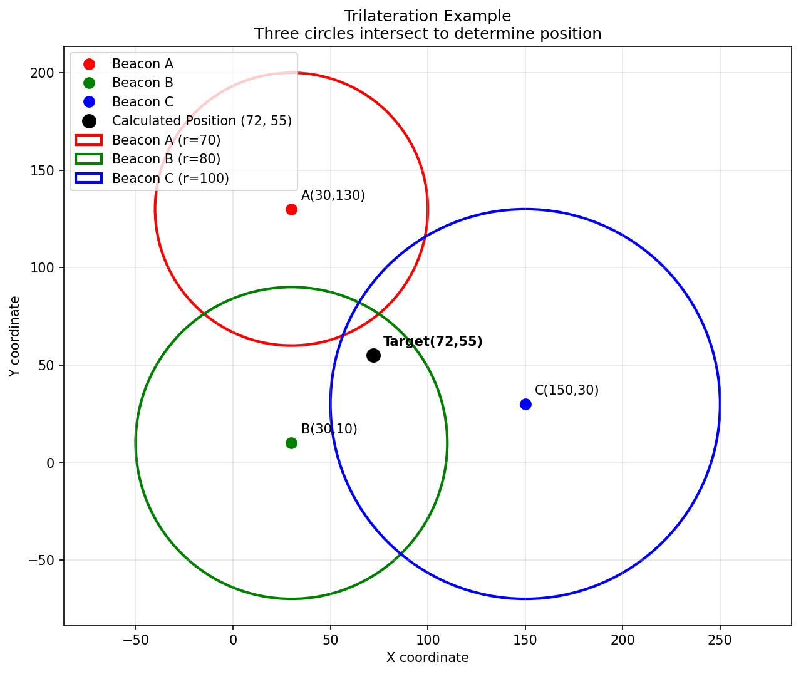

# Trilateration Example

A Python implementation demonstrating **trilateration** - a mathematical technique for determining the position of an unknown point using distance measurements from three known reference points (beacons).



## 🎯 What is Trilateration?

Trilateration is a positioning method that calculates the location of a target object by measuring its distance to three or more fixed reference points (beacons). Unlike triangulation which uses angles, trilateration relies purely on distance measurements.

**How it works:**
1. Each beacon measures its distance to the target object
2. This creates a circle of possible positions around each beacon
3. The target's location is where all three circles intersect
4. Mathematical algorithms solve for the exact intersection point

## 🔬 Real-World Applications

- **GPS Navigation**: Satellites act as beacons, distances calculated from signal travel time
- **Indoor Positioning**: WiFi/Bluetooth beacons using signal strength (RSSI)
- **Emergency Services**: Locating cell phone callers using cell towers
- **Robotics**: Robot localization using ultrasonic or laser beacons
- **Maritime/Aviation**: Navigation using radio beacons

## 🧮 Mathematical Foundation

The algorithm converts three circle equations into a solvable linear system:

**Circle equations:**
```
(x - xA)² + (y - yA)² = rA²  (Beacon A)
(x - xB)² + (y - yB)² = rB²  (Beacon B) 
(x - xC)² + (y - yC)² = rC²  (Beacon C)
```

**Linear system (after expansion and subtraction):**
```
Line 1: (2xB - 2xA)x + (2yB - 2yA)y = rA² - rB² + xB² - xA² + yB² - yA²
Line 2: (2xC - 2xB)x + (2yC - 2yB)y = rB² - rC² + xC² - xB² + yC² - yB²
```

The intersection of these two lines gives the target position (x, y).

## 📁 Project Structure

```
Trilateration-Example/
├── README.md                    # This file
├── trilaterate.py              # Main interactive simulation
├── simple_trilateration_demo.py # Static visualization generator
└── trilateration_example.png   # Sample output image
```

## 🚀 Quick Start

### Prerequisites

**System Requirements:**
- Python 3.6+
- X11 display server (for GUI visualization)

**Ubuntu/Debian:**
```bash
sudo apt-get update
sudo apt-get install python3-tk libfreetype6-dev libpng-dev
```

**Python Dependencies:**
```bash
pip install matplotlib numpy
```

### Running the Examples

**1. Interactive Real-time Simulation:**
```bash
python trilaterate.py
```
- Opens matplotlib window with live animation
- Shows moving target being tracked by trilateration
- Displays calculation details in terminal
- Close window to exit

**2. Static Visualization:**
```bash
python simple_trilateration_demo.py
```
- Generates `trilateration_example.png`
- Shows single trilateration scenario
- Good for understanding basic concept

## 🎮 Understanding the Visualization

### Interactive Elements:
- **Red Circle & Dot**: Beacon A and its detection range
- **Green Circle & Dot**: Beacon B and its detection range  
- **Blue Circle & Dot**: Beacon C and its detection range
- **Black Dot**: Calculated target position
- **Grid**: Coordinate reference system

### What You'll See:
1. Three colored circles representing beacon detection ranges
2. Circles change size as simulated distances change
3. Black target dot moves to new intersection point
4. Real-time coordinate updates

## 🔧 Customizing the Simulation

### Modify Beacon Positions:
```python
# In main() function
xA, yA = 50, 150    # Move beacon A
xB, yB = 10, 20     # Move beacon B  
xC, yC = 200, 40    # Move beacon C
```

### Adjust Initial Distances:
```python
zA = 80  # Distance from beacon A
zB = 90  # Distance from beacon B
zC = 110 # Distance from beacon C
```

### Create Custom Movement Patterns:
```python
for i in range(1, 50):
    zA += 2    # Move away from A faster
    zB -= 1    # Move toward B slower
    zC += 0.5  # Move away from C very slowly
    getlocation(xA,yA,zA,xB,yB,zB,xC,yC,zC)
```

## 🐛 Troubleshooting

### No GUI Window Appears:
```bash
# Check X11 display
echo $DISPLAY
xset q

# Try forcing display
DISPLAY=:0 python trilaterate.py
```

### Import Errors:
```bash
# Install missing dependencies
pip install matplotlib numpy

# For Ubuntu/Debian
sudo apt-get install python3-matplotlib python3-numpy
```

### Calculation Errors:
- Ensure beacons aren't collinear (not all on same line)
- Check that distances are physically possible
- Verify beacon positions are reasonable

## 📚 Code Structure

### Core Functions:

**`getlocation(xA,yA,zA,xB,yB,zB,xC,yC,zC)`**
- Implements trilateration algorithm
- Updates visualization
- Returns calculated (x,y) position

**`main()`**
- Sets up beacon positions
- Runs movement simulation
- Manages visualization window

### Algorithm Steps:
1. **Setup**: Create circle equations for each beacon
2. **Linearize**: Convert to linear system by subtracting equations
3. **Solve**: Find line intersection using algebraic methods
4. **Visualize**: Update matplotlib display with new position

## 🎓 Educational Value

This project is excellent for:
- **Mathematics**: Linear algebra, coordinate geometry, systems of equations
- **Computer Science**: Algorithms, numerical methods, visualization
- **Engineering**: Signal processing, positioning systems, sensor fusion
- **Physics**: Wave propagation, measurement uncertainty, geometric relationships

## 🤝 Contributing

Feel free to enhance this project:
- Add noise/uncertainty modeling
- Implement weighted least squares for >3 beacons
- Create 3D trilateration version
- Add different distance measurement models
- Improve visualization with better graphics

## 📖 References

- [Trilateration on Wikipedia](https://en.wikipedia.org/wiki/Trilateration)
- [GPS and Trilateration](https://en.wikipedia.org/wiki/Global_Positioning_System)
- [Multilateration](https://en.wikipedia.org/wiki/Multilateration)

## 📄 License

This project is open source and available under standard terms.

---
*Created as an educational demonstration of trilateration algorithms and real-time positioning systems.*

